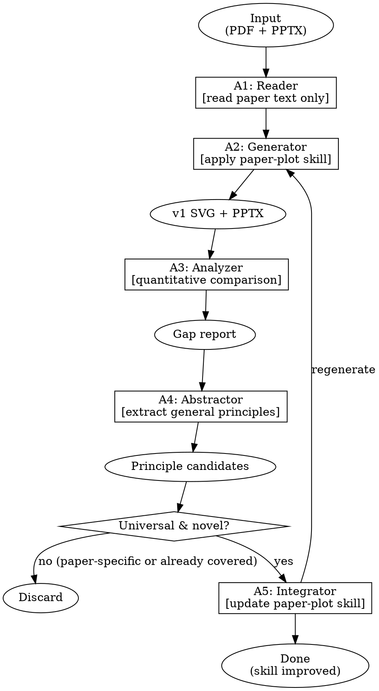

# Analyze-Plot — Skill Improvement via Case Study

## When to Use

User provides an `example/` folder containing:
- A paper PDF (the new system to analyze)
- A reference PPTX (the original paper's overview figure — ground truth for comparison)

This skill runs the full loop: **read paper → generate figure → compare with original → extract principles → improve paper-plot**.

## Overview

5-phase process. Each phase produces concrete artifacts. The terminal output is skill improvements to `paper-plot`.

| Phase | Role | Output |
|-------|------|--------|
| **A1** | **Reader** — Extract system architecture from paper text ONLY | Architecture summary |
| **A2** | **Generator** — Apply current paper-plot principles to generate overview | SVG + PPTX (v1) |
| **A3** | **Analyzer** — Compare generated figure with ground-truth original | Gap analysis report |
| **A4** | **Abstractor** — Extract generalizable principles from specific gaps | Principle candidates |
| **A5** | **Integrator** — Update paper-plot skill files with new principles | Skill file diffs |

## Hard Gates

<HARD-GATE-A1>
Do NOT look at the original PPTX during A1/A2. Read paper TEXT ONLY. The generator must rely on the skill, not on copying the original.
</HARD-GATE-A1>

<HARD-GATE-A3>
Gap analysis must be QUANTITATIVE. Compare: aspect ratio, element density, text budget, pattern selection, layout structure. No vague "looks different" — measure the difference.
</HARD-GATE-A3>

<HARD-GATE-A4>
Principles must be PAPER-AGNOSTIC. Every candidate must pass 4 gates:
1. Entity Replacement Test — replace all nouns with [X], [Y]; does the rule still hold?
2. Domain Substitution Test — name 3 different CS subfields where it applies
3. Negative Example Test — name a scenario where applying it would be WRONG
4. Non-Obviousness Test — would a grad student figure this out? If yes, too obvious.

8 forbidden patterns cause AUTOMATIC REJECTION: technology names, specific metrics, vacuous advice, specific layouts, color prescriptions, paper references, single-word virtues, duplicates of existing rules.

Write the full transformation chain (paper observation → abstraction step 1 → abstraction step 2 → final principle) for EVERY candidate. If you cannot complete the chain, the candidate is not real — DISCARD.
</HARD-GATE-A4>

<HARD-GATE-A5>
Skill updates must be minimal and surgical. Add new principles, patterns, or rules — do NOT rewrite existing content unless it's wrong. Each change must cite which gap it addresses.
</HARD-GATE-A5>

## Process Flow



## A1: Reader — Extract Architecture from Text

### Input
- Paper PDF path
- Reference PPTX path (DO NOT LOOK AT IT YET)

### Process

1. Extract text from PDF (use `pymupdf` or `source_to_md.py`)
2. Identify the SYSTEM ARCHITECTURE from text descriptions only:
   - What is the problem being solved?
   - What are the main components?
   - How do they connect?
   - What are the temporal stages (if any)?
   - What data entities flow through the system?
   - Is this improving an existing method or proposing something entirely new?
3. Write an architecture summary (≤ 1 page)

### Output
- `figures/<name>/architecture-summary.md`

## A2: Generator — Apply paper-plot Skill

### Input
- Architecture summary from A1
- Current paper-plot skill files

### Process

1. Invoke `paper-plot` skill's P0/P1 decision flow:
   - Run pattern selection decision tree to choose layout pattern
   - Apply overview figure design principles (§0c)
   - Apply layout density rules (§0d)
   - Determine canvas dimensions and aspect ratio
2. Generate SVG using the chosen pattern
3. Convert to PPTX via `svg_to_pptx.py`
4. Save as v1

### Output
- `figures/<name>/fig-<name>-v1.svg`
- `figures/<name>/fig-<name>-v1.pptx`

## A3: Analyzer — Quantitative Gap Analysis

### Input
- Generated v1 SVG/PPTX
- Original reference PPTX

### Process

Compare the generated figure with the original across these dimensions:

| Dimension | Measure |
|-----------|---------|
| **Canvas** | Width, height, aspect ratio, single vs double column |
| **Pattern** | Which layout pattern did we choose vs what the original used? |
| **Density** | Elements / cm² in our figure vs original |
| **Text** | Total word count, avg words per label, labels >5 words |
| **Entities** | Are the same data entities visible in both? |
| **Layers** | Z-ordering, temporal separation, stage boundaries |
| **Focal point** | What draws attention in ours vs original? |
| **Color** | Semantic color coding present in original but missing in ours? |

For each gap, answer:
1. What EXACTLY is different? (quantify)
2. Why did our skill produce this gap? (root cause)
3. Is this a one-time mistake or a missing principle? (generalizability)

### Output
- `figures/<name>/gap-analysis.md`

## A4: Abstractor — Extract General Principles (STRICT)

### Input
- Gap analysis report from A3

### Process

For each gap classified as "missing principle":

#### Step 1: Formulate Candidate

- Name it (kebab-case slug, e.g., `subset-visualization`, `bandwidth-color-coding`)
- State it in ONE sentence
- Provide a counterexample (what a figure looks like WITHOUT this principle)
- State where in paper-plot it belongs (which §, which file)

#### Step 2: Abstraction Transformation (MANDATORY)

Transform the principle from paper-specific observation to abstract rule:

```
PAPER-SPECIFIC OBSERVATION (from gap analysis):
  "The original shows selected KV blocks in blue and unselected in gray."

ABSTRACTION STEP 1 — Replace domain entities with categories:
  "The original shows selected [DATA ITEMS] in [SIGNAL COLOR] and unselected in [NEUTRAL COLOR]."

ABSTRACTION STEP 2 — Generalize the category to a rule:
  "For systems that SELECT a subset from a larger pool: visually distinguish
   selected items (full color, solid border) from unselected items (gray, dashed border)."

FINAL PRINCIPLE (must pass all gates below):
  "subset-visualization: When a system selects/activates a subset from a larger
   pool, render selected items in full color with solid borders and unselected
   items in gray with reduced borders. The reader must see BOTH what is kept
   AND what is discarded without reading a single label."
```

For EVERY candidate, you MUST write out the transformation chain above in `principle-candidates.md`. If you cannot complete Step 2 (the abstraction collapses into vacuous advice like "make figures better"), the candidate is not a real principle — DISCARD.

#### Step 3: The Four Hard Gates (ALL must PASS)

**Gate 1 — Entity Replacement Test**

Replace every noun in the principle with a placeholder [X], [Y], [Z]. Does the sentence still convey a meaningful structural rule?

```
PASS: "For [X] that [SELECT] a [SUBSET] from a [LARGER POOL], visually
       distinguish [SELECTED ITEMS] from [UNSELECTED ITEMS]."
       → Meaningful structural rule. ✓

FAIL: "Use red for cross-DC [X] links."
       → "Use red for [X] links." conveys no structural rule. ✗
```

**Gate 2 — Domain Substitution Test**

Can you apply the principle to a paper from a COMPLETELY different CS subfield? Name 3 specific subfields where it would apply. If you can't think of 3, it's too narrow.

```
Example for "subset-visualization":
  1. NLP: attention head pruning → selected/kept attention heads
  2. Systems: cache eviction → kept/evicted cache lines
  3. Databases: query optimization → selected/index-scanned tuples
  → 3 domains, PASS ✓
```

**Gate 3 — Negative Example Test**

Describe a specific scenario (with a real or realistic paper) where applying this principle would produce a WORSE figure. If you cannot think of one, the principle is either too vague to be useful or you haven't thought hard enough.

```
Example for "subset-visualization":
  Negative: A paper about adding Gaussian noise to ALL embeddings for privacy.
  There is no "subset" being selected — all embeddings are transformed uniformly.
  Applying subset-visualization here would create a false dichotomy.
  → Has a negative example, PASS ✓
```

**Gate 4 — Non-Obviousness Test**

Would a competent graduate student figure this out on their own? If YES, the principle is too obvious to be worth encoding. The best principles are NON-OBVIOUS — they encode a lesson that was learned through failure.

```
FAIL: "Labels should be readable." — Obvious. Every grad student knows this. ✗
PASS: "Selected/unselected items must use different border weights." — Non-obvious.
       A grad student would use the same border for everything. ✓
```

#### Step 4: Forbidden Principle Patterns (AUTOMATIC REJECTION)

Any candidate matching these patterns is REJECTED regardless of other gates:

| Forbidden Pattern | Example (REJECT) | Why |
|------------------|------------------|-----|
| Names a specific technology | "For attention-based models..." | Not about attention — about subset selection |
| Names a specific metric | "Show accuracy improvement..." | Not about accuracy — about before/after comparison |
| Contains "should look nice" | "The figure should be visually appealing." | Vacuous — encodes nothing actionable |
| Describes a specific layout | "Put KV cache on the left, output on the right." | Layout is paper-specific — the ABSTRACT rule is what matters |
| References a color directly | "Use blue for selected, gray for unselected." | The principle is about CONTRAST, not specific colors |
| Contains "like in [Paper X]" | "As done in the RESA paper..." | Principles must stand alone, not reference examples |
| Is a single-word virtue | "Clarity." "Simplicity." | Not actionable — HOW to achieve clarity? |
| Is already in paper-plot | Check existing skill files before claiming novelty | Duplicate |

<HARD-GATE-A4>
EVERY candidate principle MUST pass ALL 4 gates AND avoid ALL 8 forbidden patterns. Write the full transformation chain and gate results in `principle-candidates.md`. If any gate fails, DISCARD the candidate. Do NOT pass a failed candidate to A5.
</HARD-GATE-A4>

### Output
- `figures/<name>/principle-candidates.md` — each candidate with:
  - Original gap (paper-specific observation)
  - Full abstraction transformation (Step 2 chain)
  - Gate results (PASS/FAIL for each of 4 gates, with evidence)
  - Final principle statement (only if all gates PASS)
  - Target location in paper-plot skill

## A5: Integrator — Update paper-plot Skill

### Input
- Approved principle candidates from A4

### Process

1. For each candidate, determine the target file and section in paper-plot:
   - Layout patterns → `p1-architect.md` §3a
   - Overview principles → `p1-architect.md` §0c
   - Density/hierarchy rules → `p1-architect.md` §0d
   - SVG generation rules → `p2-builder.md`
   - Style conventions → `style-guide.md`
2. Write the minimal change:
   - Add a new pattern, rule, or checklist item
   - Do NOT rewrite existing content unless it's factually wrong
   - Each change cites the gap it addresses
3. Sync skill files to `.claude/skills/paper-plot/`
4. Optionally: regenerate the figure with the updated skill to verify improvement

### Output
- Updated paper-plot skill files (with minimal diffs)
- Optionally: v2 figure showing improvement

## Quick Reference

| Phase | Key Action | Output |
|-------|-----------|--------|
| A1 | Read paper text, extract architecture | `architecture-summary.md` |
| A2 | Apply paper-plot, generate SVG+PPTX | `fig-<name>-v1.svg`, `.pptx` |
| A3 | Quantitative comparison with original | `gap-analysis.md` |
| A4 | Extract general principles from gaps | `principle-candidates.md` |
| A5 | Update paper-plot skill files | Skill file diffs |

## Example Folder Convention

```
example/
  <PaperName>.pdf        # The paper (text extracted, figures ignored)
  overview.pptx           # The original overview figure (ground truth)

# Output goes to:
figures/<name>/
  architecture-summary.md
  gap-analysis.md
  principle-candidates.md
  fig-<name>-v1.svg
  fig-<name>-v1.pptx
  svg-project/            # ppt-master conversion project
```

## Red Flags

- "Let me peek at the original figure to get ideas" → A1/A2 must be text-only
- "This gap is just a minor layout issue" → If it's measurable, it's worth analyzing
- "This principle only applies to attention mechanisms" → Must be abstract enough for any paper
- "Let me rewrite the entire p1-architect.md" → Skill updates must be minimal and surgical
- "The original figure is bad, we don't need to compare" → Even a bad original teaches us something about what NOT to do

## Appendix: Principle Validation Examples

### Example 1: PASSES all gates ✓

**Paper observation**: "RESA's original overview shows selected KV blocks in blue, unselected KV blocks in gray, and estimated contributions in a third accent color."

**Abstraction step 1**: "A system that SELECTS a subset of [ITEMS] from a larger [POOL] visually distinguishes [SELECTED] from [UNSELECTED] using color contrast."

**Abstraction step 2**: "For any system where a component selects/activates/filters a subset from a larger collection, the overview figure MUST visually encode three states: kept (full color, solid border), discarded (gray, reduced border), and—if applicable—estimated/recovered (accent color, distinct border style)."

**Gate 1 (Entity Replacement)**: "For any [SYSTEM] where a [COMPONENT] [SELECTS] a [SUBSET] from a [LARGER COLLECTION], visually encode [KEPT], [DISCARDED], and optionally [RECOVERED] states." → Meaningful structural rule. PASS ✓

**Gate 2 (Domain Substitution)**: (1) Compilers: register allocation—spilled vs allocated registers. (2) Networking: packet scheduling—queued vs dropped packets. (3) ML: feature selection—selected vs pruned features. PASS ✓

**Gate 3 (Negative Example)**: A paper about end-to-end encryption where ALL data is transformed uniformly with no selection/filtering step. Applying subset-visualization would create a false dichotomy where none exists. PASS ✓

**Gate 4 (Non-Obviousness)**: A grad student would color all blocks the same way. The insight that "ignored items must still be visible" is learned through seeing figures where discarded items simply disappear. PASS ✓

**Forbidden pattern check**: No technology names, no metrics, no colors prescribed as values (only as categories), no paper references. PASS ✓

**Final principle**: `subset-visualization` → Added to paper-plot `p1-architect.md` §0c.5

---

### Example 2: REJECTED (fails Gate 1 + Forbidden Pattern) ✗

**Paper observation**: "HybridEP uses red lines for cross-DC low-bandwidth communication and blue lines for intra-DC high-bandwidth communication."

**Abstraction attempt**: "Use red for expensive cross-DC communication and blue for cheap local communication."

**Gate 1 (Entity Replacement)**: "Use [COLOR1] for [EXPENSIVE CROSS-X COMMUNICATION] and [COLOR2] for [CHEAP LOCAL COMMUNICATION]." → The structural rule is about COLOR-CODING BY COST, not about "cross-DC" specifically. Need to abstract further.

**Corrected abstraction**: "When a system has communication links with different costs/bandwidths, color-code links by cost tier. Use a consistent palette: warm/saturated = expensive, cool/light = cheap. The reader must see the cost distribution at a glance."

**Gate 1 (re-check)**: "When [SYSTEM] has [LINKS] with different [COSTS], color-code by [COST TIER]." → Meaningful. PASS ✓

**But — Forbidden Pattern check**: "Use red for expensive... blue for cheap" → Contains a color prescription. FAIL ✗

**Further corrected**: "When a system has communication links with different costs/bandwidths, visually encode the cost tier on each link. The reader must see the cost distribution without counting links." → No specific colors. PASS ✓

**This is now the `bandwidth-color-coding` principle — but it's a special case of a MORE GENERAL principle: `graded-visual-encoding` (encode quantitative attributes visually). Existing paper-plot already covers this in the connector routing rules. → Duplicate check: already covered by style-guide connector semantics. DISCARD as standalone principle; instead strengthen existing rule with bandwidth-tier example.

