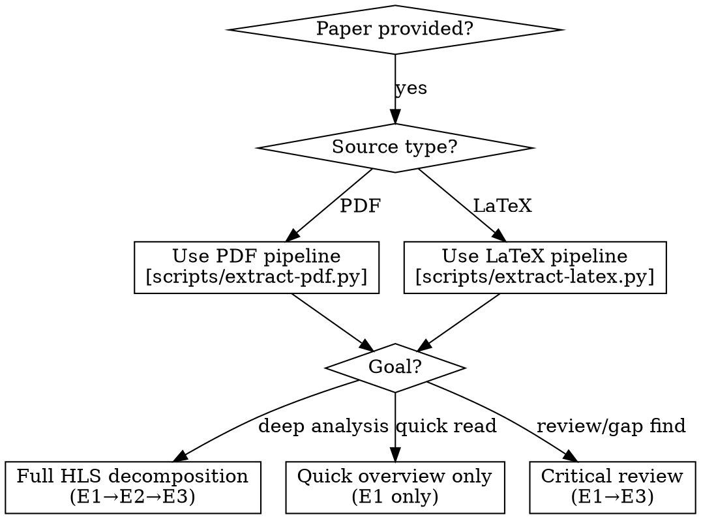

# Decision Flow — When to Use Paper Extract

**Load when:** determining whether to invoke paper-extract and which pipeline/analysis depth.

```dot
digraph when_extract {
    "Paper provided?" [shape=diamond];
    "Source type?" [shape=diamond];
    "Goal?" [shape=diamond];
    "Use PDF pipeline\n[scripts/extract-pdf.py]" [shape=box];
    "Use LaTeX pipeline\n[scripts/extract-latex.py]" [shape=box];
    "Full HLS decomposition\n(E1→E2→E3)" [shape=box];
    "Quick overview only\n(E1 only)" [shape=box];
    "Critical review\n(E1→E3)" [shape=box];

    "Paper provided?" -> "Source type?" [label="yes"];
    "Source type?" -> "Use PDF pipeline\n[scripts/extract-pdf.py]" [label="PDF"];
    "Source type?" -> "Use LaTeX pipeline\n[scripts/extract-latex.py]" [label="LaTeX"];
    "Use PDF pipeline\n[scripts/extract-pdf.py]" -> "Goal?";
    "Use LaTeX pipeline\n[scripts/extract-latex.py]" -> "Goal?";
    "Goal?" -> "Full HLS decomposition\n(E1→E2→E3)" [label="deep analysis"];
    "Goal?" -> "Quick overview only\n(E1 only)" [label="quick read"];
    "Goal?" -> "Critical review\n(E1→E3)" [label="review/gap find"];
}
```
