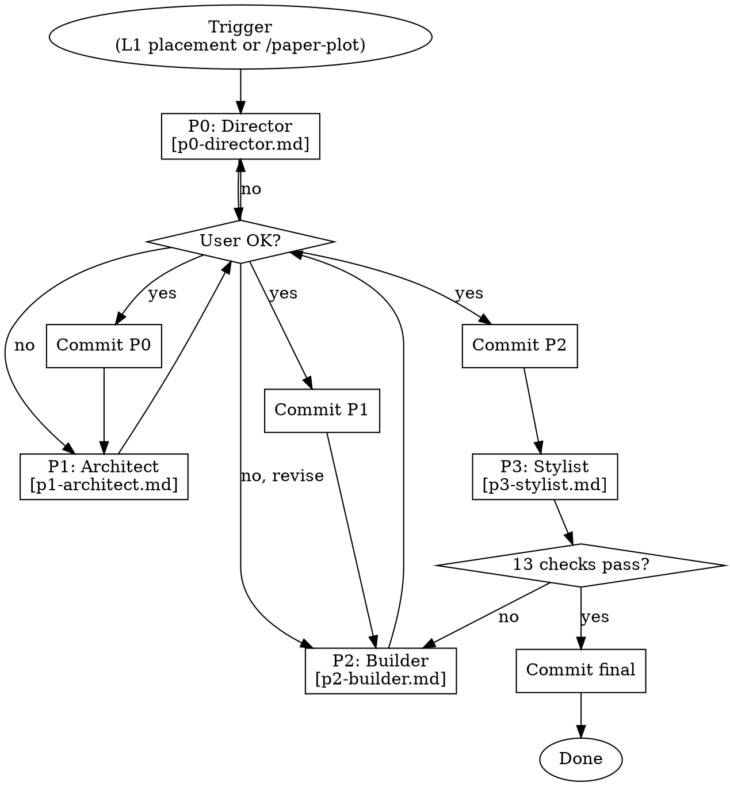

# Paper Plot — Hierarchical Figure Generation

## When to Use

| Scenario | Mode | Path |
|----------|------|------|
| During paper writing, L1 figure placement | **Embedded** | L1 → P0→P1→P2→P3 |
| Standalone figure creation | **Standalone** | `/paper-plot` → P0→P1→P2→P3 |
| Polish existing figure | **Polish** | Read figure → critical review → P2/P3 |

**Core principle:** Figures need hierarchical thinking too — from high-level intent to layout to components to visual details.

## Overview

4-level refinement, parallel to paper-writing HLS. Each level validates before descending.

| Level | Role | Reference |
|-------|------|-----------|
| **P0** | **Director** — figure intent, type selection, template matching | [p0-director.md](p0-director.md) |
| **P1** | **Architect** — spatial layout, structured spec + rough draft | [p1-architect.md](p1-architect.md) |
| **P2** | **Builder** — SVG-first generation (hand-write SVG, browser preview, convert via ppt-master) | [p2-builder.md](p2-builder.md) |
| **P3** | **Stylist** — 13-point rubric: style (6) + semantics + layout + robustness + reviewer-risk + squint-test + layer-integrity + cross-figure-consistency | [p3-stylist.md](p3-stylist.md) |

**Template-driven discovery:** Figure types predefined (architecture, flowchart, comparison, concept, data-plot). Template slides auto-discovered from `templates/` and matched by structure analysis.

Column width auto-selected: single (w=8.9cm) or double (w=17.8cm).

Every level commits to git.

## Hard Gates

<HARD-GATE-P0>
Do NOT proceed to P1 until: template slide cleaned of ALL existing shapes (the generator auto-cleans, verify it), figure type determined, template slide matched, column width selected, core elements listed in `figures/<name>/figure-intent.md`, user confirmed.
Template cleanup is MANDATORY — the generator strips all shapes from the cloned slide before adding ours. Verify output slide contains ONLY our components.
</HARD-GATE-P0>

<HARD-GATE-P1>
Do NOT proceed to P2 until: structured layout spec written to `figures/<name>/figure-layout.md`, rough PPT draft generated, user confirmed layout direction.
</HARD-GATE-P1>

<HARD-GATE-P2>
Do NOT proceed to P3 until: all components populated, all connectors drawn, all labels set, user reviewed and approved the draft.
</HARD-GATE-P2>

<HARD-GATE-P3>
Figure NOT complete until: 13-point verification rubric passed (1.color 2.font 3.arrows 4.alignment 5.spacing 6.width/export 7.semantics 8.layout/anti-overlap 9.robustness 10.reviewer-risk 11.squint-test 12.layer-integrity 13.cross-figure-consistency), all figures consistent with paper-style-lock.md, PNG 300dpi exported, text-figure component names cross-checked. Font MUST be Times New Roman. Squint Test, Layer Integrity Review, and Cross-Figure Consistency are MANDATORY.
</HARD-GATE-P3>

## Process Flow



## Quick Reference

| Level | Output | Key Action | Ref |
|-------|--------|-----------|-----|
| P0 | `figures/<name>/figure-intent.md` | Determine type, match template, list elements | [p0](p0-director.md) |
| P1 | `figures/<name>/figure-layout.md` + `figure-spec-lock.md` + draft.pptx | Design spatial layout, extract spec lock, generate rough draft | [p1](p1-architect.md) |
| P2 | `figures/<name>/figure-v{N}.pptx` | Typography-first build, grouping-first code, per-group self-check | [p2](p2-builder.md) |
| P3 | `figures/<name>/figure-final.pptx` | 13-point rubric: polish style, verify semantics/layout, squint test, layer integrity, cross-figure consistency, export PNG | [p3](p3-stylist.md) |

## Git

```bash
git commit -m "P0: figure intent for <name>"   # figures/<name>/figure-intent.md
git commit -m "P1: layout for <name>"           # figures/<name>/figure-layout.md + figure-spec-lock.md
git commit -m "P2: draft for <name>"            # figures/<name>/figure-v{N}.pptx
git commit -m "P3: final for <name>"            # figures/<name>/figure-final.pptx
```

## Red Flags

- "直接出 PPT，不用 P0/P1" → 跳过方向确认 = 方向性返工
- "一次性生成所有图" → 每张图独立走 P0-P3，P3 保持跨图风格一致
- "颜色最后再说" → P0 确定色板基调
- "图做好就行，不管文字" → P3 交叉检查图-文组件名
