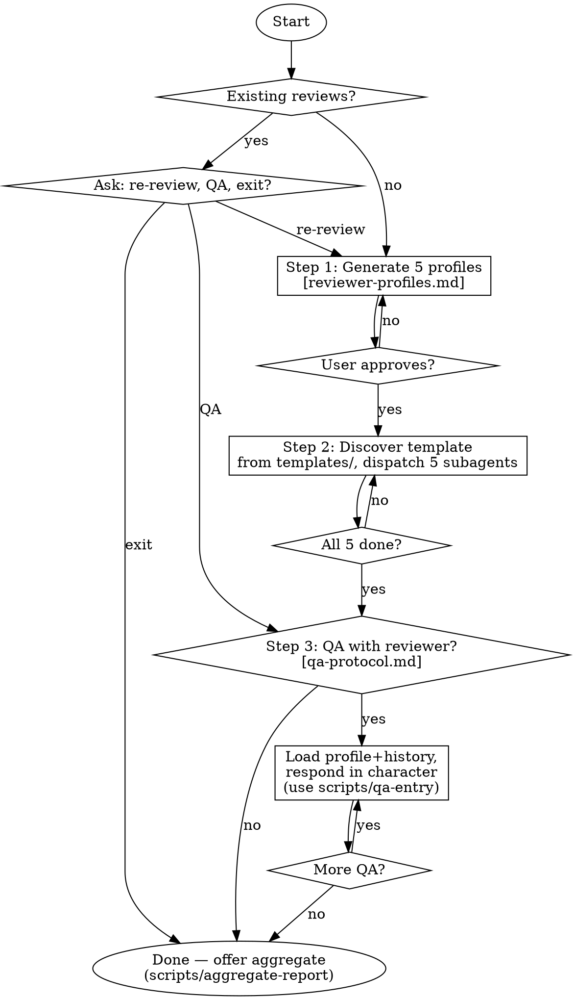

# Paper Review

**Core principle:** Realistic review requires DIVERSE PERSONAS. Five subagents embody distinct reviewers (unique domain, expertise 1-5, taste) and review in parallel. Each supports interactive QA with persistent memory.

<HARD-GATE>
Step 1 MUST complete before Step 2. Step 2 MUST complete before Step 3.
Main agent MUST NOT review — only coordinate: profiles -> dispatch -> collect -> QA.
</HARD-GATE>

## Process Flow

## Step 1: Profiles

Generate 5 reviewer profiles. **Reference:** [reviewer-profiles.md](reviewer-profiles.md). Output: `review/reviewers/profiles.md`.

<HARD-GATE-STEP1>
Before Step 2: all 4 domains covered, expertise 1-5 spread (min one 1-2, one 5), distinct tastes, user approved.
</HARD-GATE-STEP1>

## Step 2: Parallel Review

List `templates/` recursively to discover available review templates. Match by target venue. Load the matching `review-guid.md`.

Dispatch 5 subagents simultaneously. Each receives: profile + template + full paper + output path (`review/reviews/reviewer<N>/review.md`).

Task prompt: "You ARE Reviewer N. Use template at <path>. Reflect your domain, expertise, and taste. Include ALL template sections. Do NOT write as generic AI."

<HARD-GATE-STEP2>
Before Step 3: all 5 reviews complete, each follows template structure, each persona-consistent.
</HARD-GATE-STEP2>

## Step 3: Interactive QA

**Reference:** [qa-protocol.md](qa-protocol.md). Use `scripts/qa-entry.cmd` (Win) or `scripts/qa-entry.sh` (Linux) to append entries. Load profile + full QA history before every response. Answer in character.

<HARD-GATE-STEP3>
Review MUST exist before QA. Append with script, not manually. Record Internal Reasoning for consistency.
</HARD-GATE-STEP3>

## Completion

Offer `scripts/aggregate-report.cmd` (Win) or `scripts/aggregate-report.sh` (Linux). Output: `review/aggregate-report.md`.

## Guardrails

| Red flag | Reality |
|----------|---------|
| "I'll review without profiles" | No profiles = generic reviews. Step 1 first. |
| "All reviewers should be experts" | Non-experts reveal exposition gaps. Spread 1-5. |
| "I'll summarize all 5 into one" | Collapsing personas = missing the point. |
| "Same review criteria for all papers" | List `templates/`, discover types, match by venue. |
| "I remember the profile, no need to reload" | Load profile + QA history before EVERY response. |
| "Reviews look similar = consensus" | Similar reviews = persona collapse, not validation. |
