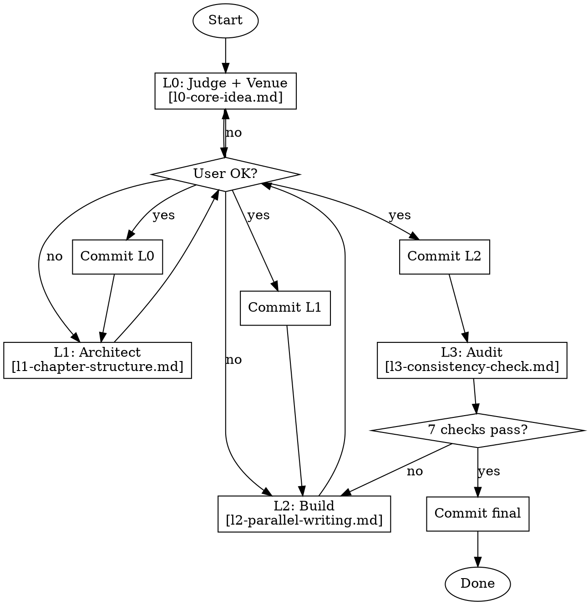

# Paper Writing — Hierarchical Logic Stream (HLS)

## When to Use

| Scenario | Mode | Path |
|----------|------|------|
| Starting a paper from scratch | **Write** | Full HLS: L0 → L1 → L2 → L3 |
| Polishing an existing draft (no HLS) | **Polish** | Extract L0/L1 from draft → critical review → L2/L3 |
| Polishing an existing draft (HLS exists) | **Polish** | Critical review L0/L1 → L2/L3 |
| Language polish only (draft is structurally sound) | **Polish-lite** | Skip L0/L1. Use existing structure, run L2/L3 for prose |

**Core principle:** Write mode builds from ideas. Polish mode extracts structure from a draft. Both use the same HLS levels — only the starting point differs.

## Overview

4-level refinement. Each level validates before descending. No skipping. No merging.

| Level | Role | Reference |
|-------|------|-----------|
| **L0** | **Judge** — pressure-test thesis, determine venue | [l0-core-idea.md](l0-core-idea.md) |
| **L1** | **Architect** — design custom Section flow chains | [l1-chapter-structure.md](l1-chapter-structure.md) |
| **L2** | **Builder** — draft/revise Sections | [l2-parallel-writing.md](l2-parallel-writing.md) |
| **L3** | **Auditor** — cross-validate L0↔L1↔L2 | [l3-consistency-check.md](l3-consistency-check.md) |

**Venue-driven discovery:** Target venue determined at L0. All resources (skeleton, blueprint, writing guide) auto-discovered by exploring `templates/` — never hardcoded.

Every level commits to git.

## Universal Interaction Protocol

**All L0/L1 confirmations use clickable options — never free-text.** The user clicks, does not type.

| Interaction | Option Pattern |
|-------------|---------------|
| **Venue selection** | List discovered venues as clickable options (e.g., "NeurIPS (9pg)", "ICML (8pg)", "AAAI (7pg)", "OSDI (12pg)"), mark recommendation |
| **Point judgment** | "PASS — [reason]" / "WEAK — [what's missing]" / "REJECT — [why]" as selectable options |
| **Section name** | 2-3 name options with purpose, mark recommendation |
| **Flow chain** | Accept / Reorder / Add step / Remove step / Revise |
| **Figure placement** | Accept / Move X to step Y / Add at step Z |
| **Polish issue** | "Accept suggestion" / "Revise — [counter-proposal]" / "Skip — not relevant" |
| **Proceed** | "Confirmed → next" / "Let me revise this" |

**Every prompt to the user MUST end with a set of clickable options.** L0 and L1 each specify which options apply at which step.

## Polish Mode

When polishing an existing draft, HLS documents MUST be generated — not just discussed verbally.

1. **If no L0/L1 exists** — read draft → extract implicit HLS → **critical think silently** (identify issues, form 2-3 suggestions) → present to user → discuss → **write `docs/systematic-research/plans/stream-L0.md` and `stream-L1.md`** → commit
2. **If L0/L1 exist** — critical review: points still valid? chains match draft? → **critical think** (2-3 issues + suggestions) → present → discuss → update L0/L1
3. **Invoke L2** — parallel revision following (revised) flow chains + writing guide
4. **Invoke L3** — consistency check (7 structural + prose checks). Polish complete when all checks pass.

**Polish-lite (language only):** User says "just polish the language" → use writing guide for voice/pitfalls → L2 revise prose → L3 consistency. Do NOT restructure.

### Write Mode (Full HLS)

Standard flow: L0 → L1 → L2 → L3. Start from ideas, end with paper.

## Hard Gates

<HARD-GATE-L0>
Do NOT proceed to L1 until: target venue determined, 6 core points written to `docs/systematic-research/plans/stream-L0.md`, each point discussed ONE AT A TIME and judged PASS, NOT rejected, user confirmed each point individually.
Do NOT batch all 6 points into a single message. Ask one → judge → user confirms → next.
**Every challenge MUST pass the causal test:** "would solving the root cause eliminate this?" Weak links = reject or remove the challenge.
</HARD-GATE-L0>

<HARD-GATE-L1>
Do NOT proceed to L2 until: each Section proposed ONE AT A TIME, name confirmed, A→B→C flow chain defined and confirmed, figures placed, L1 document accumulated incrementally and user approved.
Do NOT present all Sections at once. Propose Section N → discuss → confirm name → define chain → confirm chain → next Section.
</HARD-GATE-L1>

<HARD-GATE-L2>
Do NOT proceed to L3 until: skeleton copied to `paper/`, every Section drafted by its OWN parallel agent (all dispatched simultaneously, one per Section), each Section follows its L1 flow chain, abstract written (5-sentence formula, consistent with all Sections), user reviewed each Section.
Do NOT write Sections sequentially. Dispatch all Section agents at once.
</HARD-GATE-L2>

<HARD-GATE-L3>
Paper NOT complete until: all 7 consistency checks pass (6 structural + 1 fine-grained line-by-line prose polish), report shows zero issues.
</HARD-GATE-L3>

## Process Flow



## Quick Reference

| Level | Output | Key Action | Ref |
|-------|--------|-----------|-----|
| L0 | `docs/systematic-research/plans/stream-L0.md` | Venue + judge 6 points, reject until clear | [l0](l0-core-idea.md) |
| L1 | `docs/systematic-research/plans/stream-L1.md` | Propose 2-3 custom structures, define A→B→C chains | [l1](l1-chapter-structure.md) |
| L2 | `paper/` dir | Write: draft Sections + abstract. Polish: revise Sections + abstract following writing guide | [l2](l2-parallel-writing.md) |
| L3 | Consistency report | Run 7 checks (6 structural + 1 prose), fix root causes. Polish-lite also runs L3 | [l3](l3-consistency-check.md) |

## Git

```bash
git commit -m "L0: core idea for <topic>"   # docs/systematic-research/plans/stream-L0.md
git commit -m "L1: structure for <topic>"   # docs/systematic-research/plans/stream-L1.md
git commit -m "L2: draft for <topic>"       # paper/
git commit -m "L3: final for <topic>"       # paper/
```

## Red Flags

- "The core idea is clear enough, let's start writing" → return to L0
- "We can figure out the details while writing" → return to L0
- "This point is obvious, no need to write it down" → return to L0
- "We can't write anything until experiments are finished" → return to L0 (draft mode exists)
- "We can just make up placeholder numbers without marking them" → stop
- "One commit at the end is fine" → return to current level
- "I'll check consistency after the paper is accepted" → return to L3
- "We need three challenges to match three designs" → return to L0 (challenges are determined by evidence, not symmetry)
- "This challenge is related to the root cause somehow" → return to L0 (causal link must be direct, strong, and testable)

## Anti-Patterns

- **Writing before clarifying** → L0 must be committed before any prose
- **Soft judgement** → use rejection criteria mechanically
- **Editing skeleton in-place** → copy to `paper/` first; templates are read-only
- **Big bang commit** → four commits, one per level
- **Hardcoding paths** → discover from venue, never assume skeleton location
