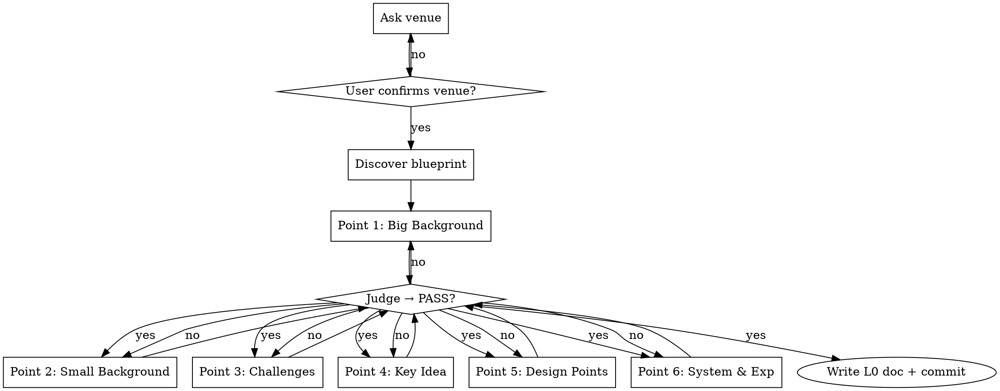

# L0 — Core Idea Stream

**Load when:** executing L0 of paper-writing (write or polish mode).

## Mode: Write vs Polish

| Mode | Starting Point | Action |
|------|---------------|--------|
| **Write** | No draft | Ask 6-point questions ONE AT A TIME. Judge each before next. Loop each until PASS. |
| **Polish** | Existing draft | Read draft → extract implicit 6 points → **critical think** (identify 2-3 issues + suggestions) → present issues ONE AT A TIME → discuss each → **write `stream-L0.md`** → commit |
| **Polish (L0 exists)** | Existing `stream-L0.md` | Critical review → **critical think** (2-3 issues + suggestions) → present issues ONE AT A TIME → discuss each → update L0 |

<HARD-GATE-L0-STEPWISE>
**ONE point at a time.** Ask → judge → user confirms → NEXT point.
Do NOT batch all 6 points into one message.
Do NOT ask user to confirm everything at once.
Each point MUST reach PASS before moving to the next.
</HARD-GATE-L0-STEPWISE>

## Critical Think (Polish Mode)

Before presenting to the user, silently review and identify:

1. **Weak points** — which of the 6 points is underdeveloped in the draft?
2. **Contradictions** — does the draft make claims that conflict with each other?
3. **Missing evidence** — where does the draft assert without data?
4. **Scope mismatch** — does the page budget (from blueprint) support the claimed contributions?

Present issues **ONE AT A TIME**. For each issue: "Issue: [X]. Suggestion: [Y]. Agree?" Wait for user before next issue.

## Checklist

1. **Determine venue** — ask first. Dictates page budget -> blueprint -> skeleton.
2. **Discover blueprint** — list `templates/`, load `BLUEPRINT.md` matching venue field + page count.
3. **Judge core points** — ONE AT A TIME. Ask point N → judge → user confirms → next. PASS / WEAK / REJECT. Loop current point until PASS, then move on.

## Step-by-Step Interaction Protocol



## Core Points

Minimum: points 1-3 + (Key Idea OR Design Points). Key Idea recommended but skip if challenge-driven (3 challenges -> 3 designs, no single insight).

| # | Point | Req | Question | Reject If |
|---|-------|-----|----------|-----------|
| 1 | **Big Background** | Yes | Macro trend / tech shift? | Vague, no academic relevance |
| 2 | **Small Background** | Yes | Specific domain? | Not concrete, no link to big |
| 3 | **Existing Challenges** | Yes | Problem + data + severity? | No data, trivial, unsubstantiated |
| 4 | **Key Idea** | Rec | ONE insight that solves it? | Doesn't address challenge |
| 5 | **Design Points (2-3)** | Yes* | Contributions? | <2 or >3, don't address challenges |
| 6 | **System & Experiments** | Yes | Built? Experimental plan? | No system AND no plan |

> *Required if no Key Idea. Experiments: plan accepted (prototype + benchmarks + baselines + expected ranges OK).

## Output

`docs/systematic-research/plans/YYYY-MM-DD-<topic>-stream-L0.md`:

```markdown
# L0: <Topic> | Venue: <venue> | YYYY-MM-DD

## 1. Big Background
## 2. Small Background
## 3. Existing Challenges
## 4. Key Idea *(skip if challenge-driven)*
## 5. Design Points
- DP1: <desc> -> addresses <challenge> by <mechanism>
- DP2/DP3: ...
## 6. System & Experiments
**System:** <status> | **Benchmarks:** <plan> | **Expected:** <ranges OK>
```

Commit: `L0: core idea for <topic>`. Proceed to L1.
