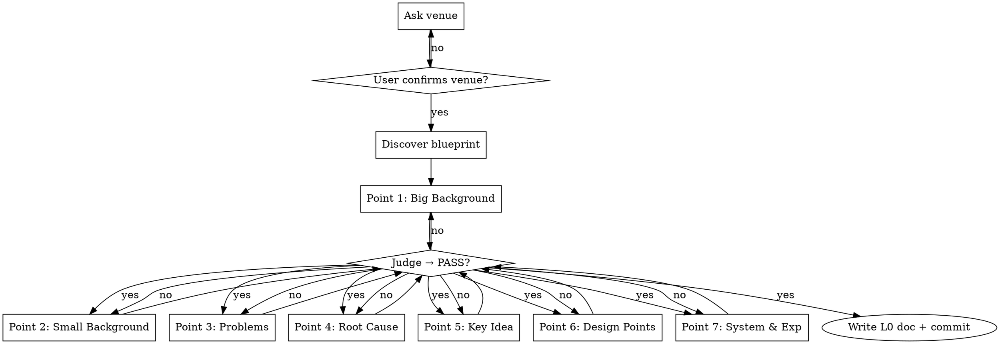

# L0 — Core Idea Stream

**Load when:** executing L0 of paper-writing (write or polish mode).

**Interaction protocol:** See [SKILL.md](SKILL.md#universal-interaction-protocol) for clickable options format. L0 uses: venue selection, point judgment, polish issue, proceed.

## Mode: Write vs Polish

| Mode | Starting Point | Action |
|------|---------------|--------|
| **Write** | No draft | Ask 7-point questions ONE AT A TIME. Judge each before next. Loop each until PASS. |
| **Polish** | Existing draft | Read draft → extract implicit 7 points → **critical think** (identify 2-3 issues + suggestions) → present issues ONE AT A TIME → discuss each → **write `docs/systematic-research/plans/stream-L0.md`** → commit |
| **Polish (L0 exists)** | Existing `stream-L0.md` | Critical review → **critical think** (2-3 issues + suggestions) → present issues ONE AT A TIME → discuss each → update L0 |

<HARD-GATE-L0-STEPWISE>
**ONE point at a time.** Ask → judge → user confirms → NEXT point. Each point MUST reach PASS before moving to the next. Do NOT batch.
</HARD-GATE-L0-STEPWISE>

**Example interaction pattern:**
> **Point 1: Big Background.** Your answer: "The rise of large vision-language models has..."
>
> **Judgment: WEAK** — too generic, needs a specific tech shift with timeline.
>
> Options: PASS / WEAK — revise with more specific trend + year range / REJECT

## Critical Think (Polish Mode)

Before presenting to the user, silently review and identify:

1. **Weak points** — which of the 7+ points is underdeveloped in the draft?
2. **Contradictions** — does the draft make claims that conflict with each other?
3. **Missing evidence** — where does the draft assert without data?
4. **Missing root cause** — are problems analysed at symptom level only? What fundamental bottleneck is unexamined?
5. **Coherence chain** — do Problems → Root Cause → Key Idea → Design Points form a self-consistent logical chain? Does Root Cause directly motivate Key Idea? Do all DPs revolve around Key Idea? Is each DP traceable to a specific problem?
6. **Clarity** — are Problems, Root Cause, Key Idea, and Design Points all stated plainly and easy to understand? Any mystifying / buzzword-laden language?
7. **Scope mismatch** — does the page budget (from blueprint) support the claimed contributions?

Present issues **ONE AT A TIME**. For each issue: "Issue: [X]. Suggestion: [Y]. Agree?" Wait for user before next issue.

## Checklist

1. **Determine venue** — ask first. Dictates page budget -> blueprint -> skeleton.
2. **Discover blueprint** — list `templates/`, load `BLUEPRINT.md` matching venue field + page count.
3. **Judge core points** — ONE AT A TIME. Ask point N → judge → user confirms → next. PASS / WEAK / REJECT. Loop current point until PASS, then move on.

## Step-by-Step Interaction Protocol



## Core Points

Minimum: points 1-3 + (Key Idea OR Design Points). Root Cause (Point 4) strongly recommended — synthesises the deeper pattern behind all problems. Key Idea recommended but skip if problem-driven (1-3 problems → 1-4 designs, no single insight).

| # | Point | Req | Question | Reject If |
|---|-------|-----|----------|-----------|
| 1 | **Big Background** | Yes | Macro trend / tech shift? | Vague, no academic relevance |
| 2 | **Small Background** | Yes | Specific domain? | Not concrete, no link to big |
| 3 | **Existing Problems (1-3)** | Yes | Problem + data + severity? | No data, trivial, unsubstantiated, mystifying |
| 4 | **Root Cause** | Rec | What deeper pattern underlies ALL these problems? What fundamental bottleneck do they share? | Symptom-level only, no synthesis, mystifying |
| 5 | **Key Idea** | Rec | ONE insight that addresses the root cause? | Doesn't address root cause, mystifying / not easy to understand |
| 6 | **Design Points (2-4)** | Yes* | Each addresses which problem? | <2 or >4, doesn't map to problems, mystifying |
| 7 | **System & Experiments** | Yes | Built? Experimental plan? | No system AND no plan |

> *Required if no Key Idea. Experiments: plan accepted (prototype + benchmarks + baselines + expected ranges OK).

<HARD-GATE-L0-CLARITY>
**Problems, Root Cause, Key Idea, and Design Points MUST be plain and easy to understand.**
No buzzwords. No mystification. A first-year PhD student in the field should grasp each point in one read. If a point sounds profound but no one can explain it back — REJECT.
</HARD-GATE-L0-CLARITY>

<HARD-GATE-L0-COHESION>
**Problems, Root Cause, Key Idea, and Design Points MUST form a closed loop.**
- Root Cause is an overview — one deeper pattern / fundamental bottleneck that explains why ALL problems persist
- The Root Cause must directly motivate the Key Idea — "because the root cause is <X>, the Key Idea is necessary"
- Each Design Point (DP1, DP2, ..., DP4) must address a specific problem — state which one
- The loop: Problems → Root Cause (overview) → Key Idea solves it → Design Point implements the solution → Problem resolved
- Reject scattered designs that don't trace back to a problem. Reject root cause that the Key Idea doesn't address.

At Point 4 (Root Cause), explicitly state: The fundamental bottleneck is <X>. Prior work failed because <reason>.
At Point 6 (Design Points), explicitly verify: DP1 addresses P<N> by <mechanism>. DP2 addresses P<N> by <mechanism>. ... All problems covered. All DPs revolve around the Key Idea.
</HARD-GATE-L0-COHESION>

## Output

`docs/systematic-research/plans/stream-L0.md`:

```markdown
# L0: <Topic> | Venue: <venue> | YYYY-MM-DD

## 1. Big Background
## 2. Small Background
## 3. Existing Problems
- P1: <desc> | Data: <evidence> | Severity: <high/medium>
- P2/P3: ...
## 4. Root Cause
<ONE deeper pattern / fundamental bottleneck underlying ALL problems. Why prior work failed to solve them.>
## 5. Key Idea *(skip if problem-driven)*
## 6. Design Points
- DP1: <desc> -> addresses P<N> by <mechanism>
- DP2/DP3/DP4: ...
## 7. System & Experiments
**System:** <status> | **Benchmarks:** <plan> | **Expected:** <ranges OK>
```

Commit: `L0: core idea for <topic>`. Proceed to L1.
