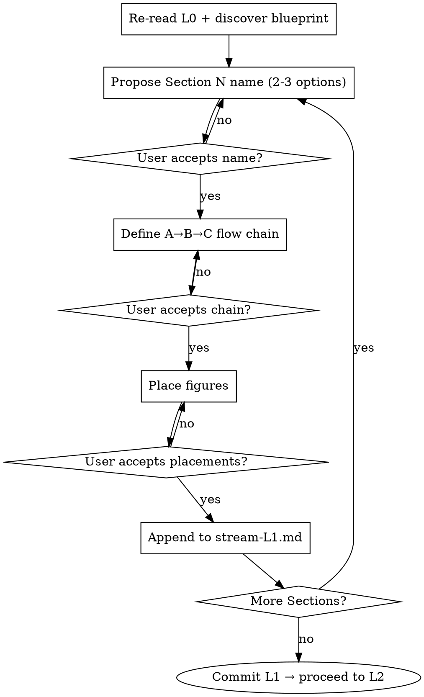

# L1 — Chapter Structure Stream (The Architect Phase)

**Load when:** L1 phase. Design custom Section/Subsection flow chains.

**Prerequisites:** SKILL.md hard gates. L0 complete, venue known.

**Interaction protocol:** See [SKILL.md](SKILL.md#universal-interaction-protocol) for clickable options format. L1 uses: section name, flow chain, figure placement, polish issue, proceed.

---

## Hard Gate

<HARD-GATE>
ONE Section at a time. Propose → confirm name → define chain → confirm chain → place figures → NEXT.
Never present all Sections at once. Every confirmation uses clickable options — never free-text.
</HARD-GATE>

---

## Process Flow



---

## Core Loop

For EACH Section, 4 steps. Loop within each step until user accepts.

### Step 1: Propose Name
2-3 name options with purpose. Mark recommendation. User clicks one.

> **Section 1: Introduction**
> Purpose: Establish task, identify gap, present insight, preview results.
> - Introduction (standard) ← recommended
> - Introduction & Background (merged)
> - Introduction with Motivation

### Step 2: Define Flow Chain
A→B→C chain. Each item = one logical dependency. Descriptive names ("Why existing solutions fail"), not numbers ("Step 3").

### Step 3: Place Figures
List where figures belong in this Section.

### Step 4: Confirm & Proceed
Append confirmed Section to L1 document. Offer: Next Section / Revise this Section.

---

## L1 Mode Differences

| Mode | L1 Action |
|------|----------|
| **Write** | Core Loop from scratch for each Section |
| **Polish (no L1)** | Extract implicit structure from draft → Critical Think → Core Loop → write `stream-L1.md` |
| **Polish (L1 exists)** | Critical review existing L1 → Critical Think → update |
| **Polish-lite** | Skip L1 entirely |

---

## Critical Think (Polish Only)

Silently review before presenting to user:

- **Structural flow** — Sections build logically? Gaps or redundancies?
- **Chain fidelity** — Draft follows its extracted chain, or wanders?
- **Page budget** — Section depth matches blueprint allocation?
- **Figure placement** — At natural breakpoints? Missing visual anchors?

Present issues ONE AT A TIME: "Issue: [X]. Suggestion: [Y]. Agree?"

---

## Challenge-Design Pattern

When a Section pairs Challenges with Design points:

- **Derive from Key Idea.** Ask: what does the Key Idea break or require? → orthogonal dimensions, each = one challenge.
- **Pair strictly.** Challenge → immediately following Design solves it. Reader never wonders which solves which.
- **Cover all.** If only 2 internal challenges, add a 3rd external (memory, consistency, compatibility).

---

## Figure Placement

- **Architecture/Pipeline overview** — Before component descriptions
- **Motivation graph** — Within challenge/gap step
- **Main result** — Macro-benchmarks
- **Ablation/breakdown** — Micro-benchmarks
- **Qualitative example** — After quantitative results

---

## Output

`docs/systematic-research/plans/stream-L1.md` — built incrementally:

```markdown
# L1 Structure: <Topic> | <venue> | YYYY-MM-DD

## Section 1: <Name>
A. <step>
B. <step>
*Figures: <list>*

## Section 2: <Name>
### Subsection 2.1: <Name>
A. <step>
```

Commit: `L1: structure for <topic>`. Proceed to L2.
