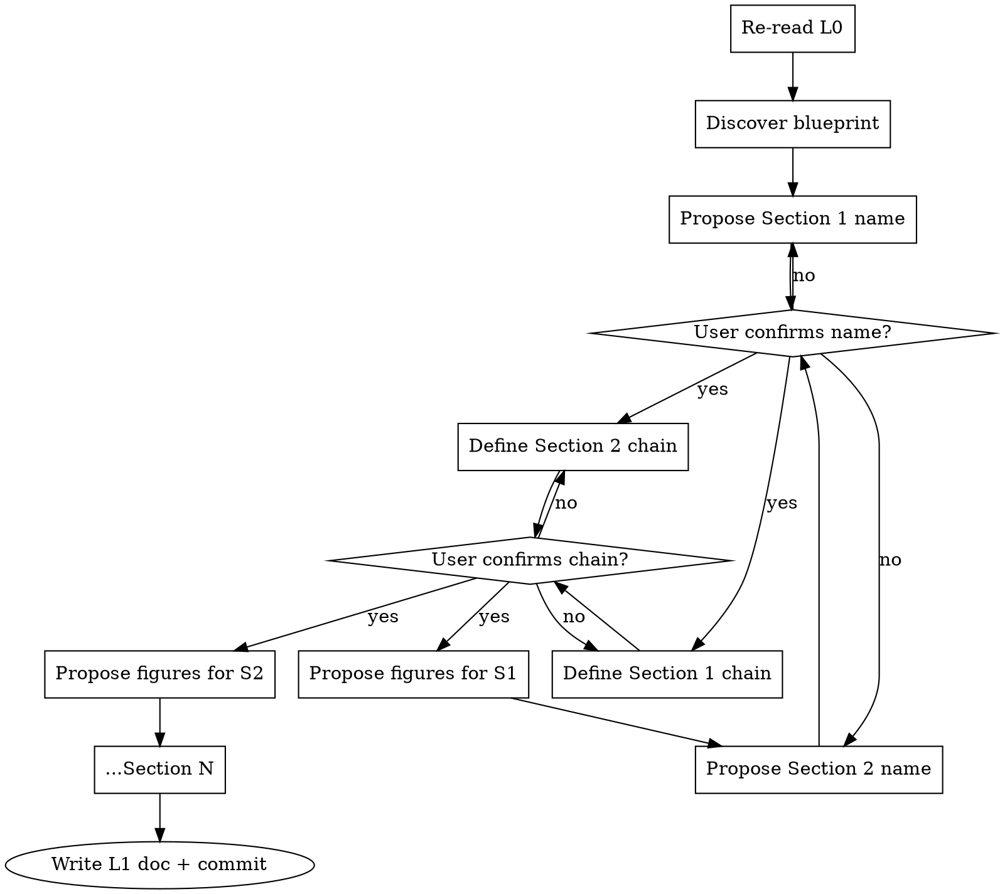

# L1 — Chapter Structure Stream (The Architect Phase)

**Load when:** executing L1. Defines the discussion-driven process for custom Section/Subsection structures.

**REQUIRED BACKGROUND:** SKILL.md hard gates. L0 complete with venue.

<HARD-GATE-L1-STEPWISE>
**ONE Section at a time.** Propose → discuss → user confirms → define chain → NEXT Section.
Do NOT present all Sections at once.
Do NOT ask user to confirm the entire structure in one go.
Each Section must be confirmed (name + flow chain) before moving to the next.
</HARD-GATE-L1-STEPWISE>

## Interaction Pattern

**At every confirmation point, present clickable options. Do NOT ask the user to type free-text responses.**

| Interaction | Option Pattern |
|-------------|---------------|
| **Section name proposal** | 2-3 name options as clickable choices, mark recommendation |
| **Flow chain confirmation** | "Accept chain" / "Reorder steps" / "Add step" / "Remove step" / "Revise — [suggestion]" |
| **Figure placement** | "Accept placements" / "Move figure X to step Y" / "Add figure at step Z" |
| **Polish issue** | "Accept suggestion" / "Revise — [counter]" / "Skip" |
| **Proceed to next Section** | "Confirmed → next Section" / "Let me revise this Section" |

## Mode: Write vs Polish

| Mode | Starting Point | Action |
|------|---------------|--------|
| **Write** | L0 only (no draft) | Propose Sections ONE AT A TIME. For each: propose name → discuss → define A→B→C chain → user confirms → next. |
| **Polish** | L0 + existing draft | Extract implicit structure → **critical think** (identify 2-3 issues + suggestions) → present issues ONE AT A TIME → discuss each → **write `docs/systematic-research/plans/stream-L1.md`** |
| **Polish (L1 exists)** | Existing `docs/systematic-research/plans/stream-L1.md` | Critical review → **critical think** (2-3 issues + suggestions) → present issues ONE AT A TIME → discuss each → update |

## Critical Think (Polish Mode)

Before presenting to the user, silently review:

1. **Structural flow** — do Sections build on each other logically? Are there gaps or redundancies?
2. **Chain fidelity** — does the draft actually follow the extracted A→B→C flow, or does it wander?
3. **Page budget fit** — does each Section's depth match its page allocation from the blueprint?
4. **Figure placement** — are figures at natural breakpoints in the flow? Any missing visual anchors?

Present issues **ONE AT A TIME**. For each: "Issue: [X]. Suggestion: [Y]. Agree?" Wait for user before next issue.

## Checklist

1. **Re-read L0.** Venue known.
2. **Discover blueprint.** Explore `templates/` → load `BLUEPRINT.md` → match by page count. Page budget constrains scope.
3. **Propose Section 1** — name, purpose, how it maps to L0. User confirms. Then define its A→B→C chain. User confirms chain.
4. **Propose Section 2** — same process. Then Section 3, Section 4... ONE AT A TIME.
5. **Propose figure placeholders** — after each Section's chain is confirmed: "Here's where figures go in this Section: [list]. OK?"
6. **Write L1 document.** Accumulate incrementally — append each confirmed Section to `docs/systematic-research/plans/stream-L1.md` as you go.

## Step-by-Step Interaction Protocol



## Flow Chain Rules

Each chain item is a **logical step** — what the reader must understand before the next. One idea per step. Ordered by dependency. Descriptive ("Why existing solutions fail"), not numbered ("Step 3").

## Figure Placeholders

| Type | When | Typical Placement |
|------|------|------------------|
| Architecture/Pipeline overview | Design/Method — reader needs big picture first | Before component descriptions |
| Motivation graph | Background — data proving the problem | Within challenge/gap step |
| Main result graph/table | Evaluation — headline comparison | Macro-benchmarks |
| Ablation/breakdown | Evaluation — isolate contributions | Micro-benchmarks |
| Qualitative example | Analysis — what output looks like | After quantitative results |

## Per-Section Interaction Template

For EACH Section, present clickable options at every step:

1. **Propose name + purpose** — present 2-3 name options with brief purpose. Mark recommendation. User clicks one.
2. **Wait for selection.** If none accepted, propose alternatives. If accepted, proceed.
3. **Define flow chain** — present A→B→C chain. Offer options: "Accept chain" / "Reorder steps" / "Add a step" / "Remove a step".
4. **Wait for selection.** Revise per user's choice. Loop until "Accept chain".
5. **Propose figures** — list placements. Options: "Accept placements" / "Move/Add figure".
6. **Append confirmed Section to L1 document.** Then offer: "Confirmed → next Section" / "Revise this Section".

Example interaction:

> **Section 1: Introduction**
>
> Purpose: Establish task, identify gap, present insight, preview results.
>
> Options:
> - Introduction (standard)
> - Introduction & Background (merged)
> - Introduction with Motivation

User clicks → then chain → then figures. Each step = clickable choices, no typing.

## Output

`docs/systematic-research/plans/stream-L1.md` — built incrementally, one Section at a time:

```markdown
# L1 Chapter Structure Stream: <Topic> | Venue: <venue> | Date: YYYY-MM-DD

## Section 1: <Name from discussion>
A. <step> 
B. <step> 
C. <step> 
...

## Section 2: <Name from discussion>
### Subsection 2.1: <Name>
A. <step> 
B. <step> 
C. <step>
```

Commit with `L1: structure for <topic>`. Proceed to L2.
