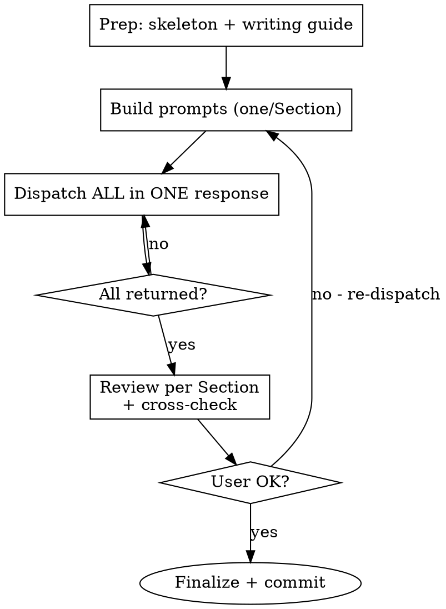

# L2 — Parallel Writing Stream (The Builder Phase)

**Load when:** executing L2 (write or polish). One subagent per Section, dispatched in parallel.

**REQUIRED BACKGROUND:** L1 complete. Reference: [dispatching-parallel-agents](../../../superpowers/skills/dispatching-parallel-agents/SKILL.md).

<HARD-GATE-L2-PARALLEL>
Every Section = its own subagent. ALL dispatched in ONE response (parallel).
Do NOT: write sequentially, batch Sections, or dispatch one at a time.
Use runSubagent with agentName="general-purpose".
</HARD-GATE-L2-PARALLEL>

## Mode

| Mode | Action |
|------|--------|
| **Write** | Copy skeleton → one subagent per L1 Section |
| **Polish** | Load `paper/` → one subagent per L1 Section to revise |
| **Polish-lite** | Load draft → one subagent per Section, prose only |

## Process Flow



## Step 1: Prep

1. Copy skeleton to `paper/` (explore `templates/` → match venue)
2. Load `writing-guide.md` + `BLUEPRINT.md`
3. From L1: extract each Section's name, A→B→C chain, figure placeholders, page budget

## Step 2: Build Subagent Prompts

For EACH Section, one self-contained prompt:

```markdown
Write Section <N>: <Name> for a <venue> paper.

**L0 Core Idea:** <Big/Small background, Key Idea, Design Points>

**Blueprint Constraint (BINDING):**
- Section structure: <from blueprint>
- Paragraph budget: <N> paragraphs total, each 3-5 sentences max
- Page allocation: ~<X>% of paper

**Your Flow Chain (L1):**
A. <step> → B. <step> → C. <step> → ...

**Writing Guide (copy-paste exact excerpt for this Section type):**
<Paste from writing-guide.md — do NOT summarize>

**Universal rules:**
- **Paragraph structure:** Every paragraph = topic sentence → 2-4 supporting sentences → concluding/transition sentence (总分总). Minimum: topic → support (总分). The first sentence declares the paragraph's point; the last sentence either concludes or bridges to the next paragraph.
- Vocabulary: standard ML terms only. No obscure words (ameliorate, delineate, elucidate, heretofore). Plain English.
- Paragraph length: 3-5 sentences. Max 8. One idea per paragraph.
- `[TODO: actual number]` as plain text or `% [TODO: ...]` LaTeX comment. NEVER inside `$$` or `$`.
- Define notation before use. Evidence-backed claims. "we". Specific > vague.

**Figures:** `[Figure: <desc>. figs/<name>.pdf]` at chain step <letter>.

**Output:** `paper/sections/<filename>.tex`. Complete LaTeX. Follow chain + blueprint exactly. `\cite{}` as venue requires. Do NOT write other Sections' content.

Return: 3-5 bullet summary + open questions.
```

<HARD-GATE-PROMPT>
Each prompt MUST include: L0 context + full L1 chain + copy-pasted writing guide excerpt (not summarized) + exact output path.
One prompt = one Section. Never combine.
</HARD-GATE-PROMPT>

## Step 3: Parallel Dispatch

ALL `runSubagent` calls in ONE response = parallel. One per response = sequential.

```
runSubagent("general-purpose", "<Section 1 prompt>")
runSubagent("general-purpose", "<Section 2 prompt>")
runSubagent("general-purpose", "<Section N prompt>")
```

<HARD-GATE-DISPATCH>
ALL Sections dispatched in same batch. None missed.
</HARD-GATE-DISPATCH>

## Step 4: Review

When all return, for each Section check: chain fidelity → writing guide compliance → figure placement → boundary (no cross-Section bleed) → page budget.

Cross-Section: consistent notation, no duplicates, valid `\ref{}`, same terminology.

User requests changes → **re-dispatch** affected Section subagent. Don't revise inline.

## Step 5: Finalize

1. Add references → `[Figure: ...]` → full `\begin{figure}` → `[TODO]` markers
2. **Write Abstract** — 5-sentence formula from blueprint. Must be consistent with all drafted Sections. Dispatch as a subagent if needed.
3. Compile check — ensure `main.tex` compiles

Commit: `L2: draft for <topic>`. Proceed to L3.

## Guardrails

| ❌ | ✅ |
|----|----|
| Sequential in main agent | One subagent per Section, parallel |
| "Write Sections 1-3" in one agent | One agent = one Section |
| Summarize writing guide | Copy-paste exact excerpt |
| Revise inline | Re-dispatch subagent |
