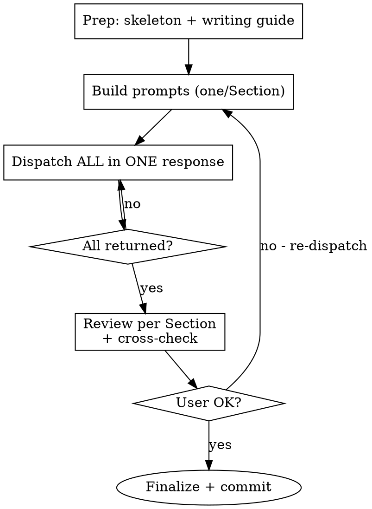

# L2 — Parallel Writing Stream (The Builder Phase)

**Load when:** executing L2 (write or polish). One subagent per Section, dispatched in parallel.

**REQUIRED BACKGROUND:** L1 completed.

<HARD-GATE-L2-PARALLEL>
Every Section = its own parallel agent. ALL dispatched simultaneously.
Do NOT: write sequentially, batch Sections, or dispatch agents one at a time.
</HARD-GATE-L2-PARALLEL>

## Mode

| Mode | Action |
|------|--------|
| **Write** | Copy skeleton → one subagent per L1 Section |
| **Polish** | Load `paper/` → one subagent per L1 Section to revise |
| **Polish-lite** | Load draft → one subagent per Section, prose only |

## Process Flow



## Step 1: Prep

1. Copy skeleton to `paper/` (explore `templates/` → match venue)
2. Load `writing-guide.md` + `BLUEPRINT.md` + `style.md`
3. From L1: extract each Section's name, A→B→C chain, figure/table placeholders, page budget

## Step 2: Build Subagent Prompts

For EACH Section, one self-contained prompt:

```markdown
Write Section <N>: <Name> for a <venue> paper.

**L0 Core Idea:** <Big/Small background, Key Idea, Design Points>

**Blueprint Constraint (BINDING — page limits exclude references):**
- Section structure: <from blueprint>
- Paragraph budget: <N> paragraphs total, each 3-5 sentences max
- Page allocation: ~<X>% of paper

**Your Flow Chain (L1):**
A. <step> → B. <step> → C. <step> → ...

**Writing Guide (copy-paste exact excerpt for this Section type):**
<Paste the absolute path to writing-guide.md for reference>

**Style Reference (copy-paste from style.md for the figure/table types in this Section):**
<Paste the absolute path to style.md for reference>

**Universal rules:**
- **Paragraph = one idea = one chain step.** Each step in your flow chain (A, B, C...) maps to exactly ONE paragraph. However, if a paragraph is too long, you can decide to seperate them. 
- **Paragraph structure:** Topic sentence → 2-3 supporting sentences → concluding/transition (总分总). First sentence declares the point. Last sentence concludes or bridges. Try use `\paragraph{}` lable to stress and summarize the topic sentence/phrase. 
- **Paragraph length: 3-5 sentences. Hard cap: 6.** If it runs longer, split at the nearest logical break. Short paragraphs are better than dense ones.
- **Sentence length: 10-25 words.** Hard cap: 30 words. No run-on sentences. Split long sentences ruthlessly.
- **Vocabulary**: standard academic terms only. No obscure words (ameliorate, delineate, elucidate, heretofore, utilize, leverage as verb). Plain English.
- `[TODO: actual number]` as plain text or `% [TODO: ...]` LaTeX comment. NEVER inside `$$` or `$`.
- Define notation before use. Evidence-backed claims. "we". Specific > vague.

**Figures & Tables:** Insert complete LaTeX environments — NOT bare `[Figure: ...]` markers. Use the exact templates from `style.md`:
- Single-column: `\begin{figure}[t]...\end{figure}`
- Double-column: `\begin{figure*}[t]...\end{figure*}`
- Tables: `\begin{table}[t]...` with `booktabs` (`\toprule`, `\midrule`, `\bottomrule`). No vertical rules.
- Draft numbers: `[TODO: value]` in table cells.
- Place at the chain step specified. Every figure/table needs: `\caption{}` (bold title + `\small` description) + `\label{}`.
- Must-have: architecture overview figure (Method Section) + main results table (Experiments Section).

**Output:** `paper/sections/<filename>.tex`. Complete LaTeX. Follow chain + blueprint exactly. `\cite{}` as venue requires. Do NOT write other Sections' content.

Return: 3-5 bullet summary + open questions.
```

<HARD-GATE-PROMPT>
Each prompt MUST include: L0 context + full L1 chain + copy-pasted writing guide excerpt (not summarized) + exact output path.
One prompt = one Section. Never combine.
</HARD-GATE-PROMPT>

## Step 3: Parallel Dispatch

Dispatch ALL Section agents simultaneously — not one after another. Every Section agent receives its prompt and works independently in parallel.

When all agents return, proceed to Step 4.

## Step 4: Review

When all return, for each Section check: chain fidelity → writing guide compliance → figure placement → boundary (no cross-Section bleed) → page budget.

Cross-Section: consistent notation, no duplicates, valid `\ref{}`, same terminology.

User requests changes → **re-dispatch** affected Section subagent. Don't revise inline.

## Step 5: Finalize

1. Add references to `paper/references.bib`
2. Verify all figures/tables: proper `\begin{figure/table}...\end{figure/table}` (not bare `[Figure: ...]`), `\caption{}` present, `\label{}` present, `booktabs` for tables, no `\hline`
3. **Write Abstract** — 5-sentence formula from blueprint. Must be consistent with all drafted Sections. Dispatch as a subagent if needed.
4. Compile check — ensure `main.tex` compiles without errors

Commit: `L2: draft for <topic>`. Proceed to L3.

## Guardrails

| ❌ | ✅ |
|----|----|
| Sequential in main agent | One subagent per Section, parallel |
| "Write Sections 1-3" in one agent | One agent = one Section |
| Summarize writing guide | Copy-paste exact excerpt |
| Revise inline | Re-dispatch subagent |
| `[Figure: desc]` text marker | `\begin{figure}[t]...\end{figure}` from style.md |
| `\hline` in tables | `\toprule`/`\midrule`/`\bottomrule` (booktabs) |
