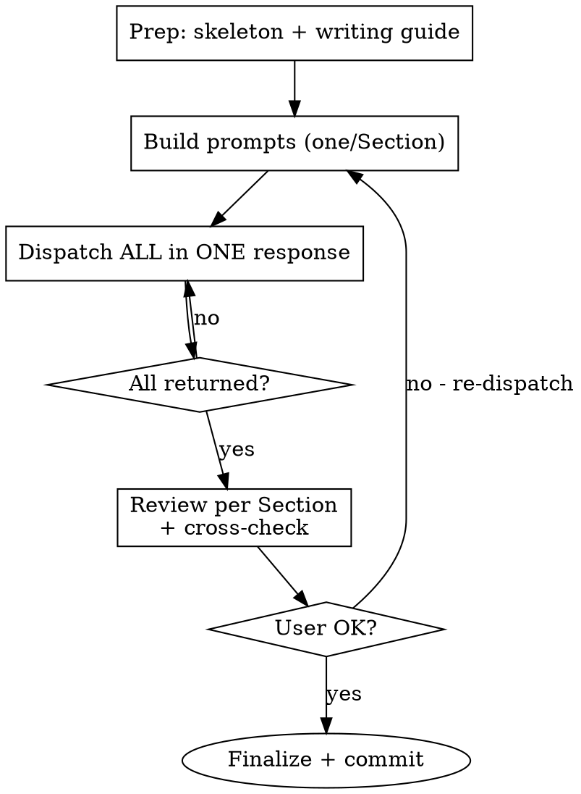

# L2 — Parallel Writing Stream (The Builder Phase)

**Load when:** executing L2 (write or polish). One subagent per Section, dispatched in parallel.

**REQUIRED BACKGROUND:** L1 completed.

<HARD-GATE-L2-PARALLEL>
Every Section = its own parallel agent. ALL dispatched simultaneously.
Do NOT: write sequentially, batch Sections, or dispatch agents one at a time.
</HARD-GATE-L2-PARALLEL>

## Mode

| Mode | Action |
|------|--------|
| **Write** | Copy skeleton → one subagent per L1 Section |
| **Polish** | Load `paper/` → one subagent per L1 Section to revise |
| **Polish-lite** | Load draft → one subagent per Section, prose only |

## Process Flow



## Step 1: Prep

1. Copy skeleton to `paper/` (explore `templates/` → match venue)
2. From L1: extract each Section's name, A→B→C chain, figure/table placeholders (width + aspect ratio), page budget
3. Note absolute paths to `writing-guide.md`, `style.md`, `BLUEPRINT.md` — subagents will read them directly

## Step 2: Build Subagent Prompts

For EACH Section, one self-contained prompt. Include file paths — the subagent reads referenced files directly.

```markdown
Write Section <N>: <Name> for a <venue> paper.

**L0 Core Idea:** <Big/Small background, Key Idea, Design Points>

**Blueprint Constraint (BINDING — page limits exclude references):**
- Section structure: <from blueprint>
- Paragraph budget: <N> paragraphs total, each 3-5 sentences max
- Page allocation: ~<X>% of paper

**Your Flow Chain (L1):**
A. <step> → B. <step> → C. <step> → ...

**L1 Figure Specs (from stream-L1.md):**
- Fig X: <purpose> | width=<N>\textwidth | aspect=<ratio> | at step <letter> | placeholder=example-image-a

**Reference files — READ these before writing:**
- Writing guide: <absolute-path-to>/writing-guide.md
- Style + figure/table templates: <absolute-path-to>/style.md
- Blueprint: <absolute-path-to>/BLUEPRINT.md

**Prose rules (detailed in writing-guide.md):**
- Paragraph = one idea = one chain step. Topic → support → conclude. 3-5 sentences, hard cap 6.
- Sentence: 10-25 words, hard cap 30. Open with the point, not context.
- Cut setup verbs (emerged/facilitated/leveraged). Em dash `---` for causal links.
- One `\ul{}` per section for the punchline. Kill the last sentence of paragraphs.
- Vocabulary: standard academic terms. No obscure words. "we", specific > vague.
- `[TODO: actual number]` as plain text, never inside `$$`.

**Figures & Tables — read style.md for complete templates. Key rules:**
- Use `example-image-a` placeholder (mwe package), NEVER a non-existent file path.
- Width from L1 spec above. Figure before its first `\ref{}` in prose.
- Caption: `\caption{\textbf{<Bold title>.} \small <One-sentence takeaway.>}` — BOTH bold title AND `\small` description required.
- Tables: `booktabs` only (`\toprule`/`\midrule`/`\bottomrule`), no `\hline`, no vertical rules.
- Must-have: architecture overview (Method) + main results table (Experiments).

**Output:** `paper/sections/<filename>.tex`. Complete LaTeX. Follow chain + blueprint exactly. Do NOT write other Sections' content.

Return: 3-5 bullet summary + open questions.
```

<HARD-GATE-PROMPT>
Each prompt MUST include: L0 context + full L1 chain + L1 figure specs (width, aspect ratio, placeholder) + absolute paths to writing-guide.md, style.md, BLUEPRINT.md + exact output path.
One prompt = one Section. Never combine.
</HARD-GATE-PROMPT>

## Step 3: Parallel Dispatch

Dispatch ALL Section agents simultaneously — not one after another. Every Section agent receives its prompt and works independently in parallel.

When all agents return, proceed to Step 4.

## Step 4: Review

When all return, for each Section check: chain fidelity → writing guide compliance → figure placement → boundary (no cross-Section bleed) → page budget.

Cross-Section: consistent notation, no duplicates, valid `\ref{}`, same terminology.

User requests changes → **re-dispatch** affected Section subagent. Don't revise inline.

## Step 5: Finalize

1. Add references to `paper/references.bib`
2. **Verify all figures/tables:**
   - Proper `\begin{figure/table}...\end{figure/table}` (not bare `[Figure: ...]`)
   - `\caption{\textbf{...}. \small ...}` — bold title + `\small` description BOTH present
   - `\label{}` present and matches `\ref{}` in prose
   - `booktabs` for tables (`\toprule`/`\midrule`/`\bottomrule`), no `\hline`, no vertical rules
   - Placeholder images use `example-image-a` (from `mwe`), not non-existent file paths
   - Figure width matches L1 spec (not default `\textwidth` unless specified)
   - Prose references figure BEFORE it appears: `Figure~\ref{fig:label}`
3. **Write Abstract** — 5-sentence formula from blueprint. Must be consistent with all drafted Sections. Dispatch as a subagent if needed.
4. Compile check — ensure `main.tex` compiles without errors

Commit: `L2: draft for <topic>`. Proceed to L3.

## Guardrails

| ❌ | ✅ |
|----|----|
| Sequential in main agent | One subagent per Section, parallel |
| "Write Sections 1-3" in one agent | One agent = one Section |
| Summarize writing guide in prompt | Give file path, subagent reads full file |
| Revise inline | Re-dispatch subagent |
| `[Figure: desc]` text marker | `\begin{figure}[t]...\end{figure}` with `example-image-a` placeholder |
| `\hline` in tables | `\toprule`/`\midrule`/`\bottomrule` (booktabs) |
| `\caption{Architecture of X.}` | `\caption{\textbf{Architecture of X.} \small Description + takeaway.}` |
| `\includegraphics{figs/nonexistent.png}` | `\includegraphics[width=<spec>]{example-image-a}` |
| Default `\textwidth` for all figures | Explicit width from L1 spec |
